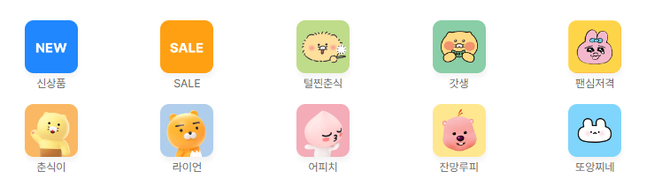

### 👀 자신이 원하는 사이트 레이아웃 클론

------

#### 🐧 KaKao Shop Clone Coding 🐧

##### 필수 요구사항

- [x] 과제에 대한 설명을 포함한 `README.md` 파일을 제공하세요!
- [x] 과제 결과와 비교할 수 있는 실제 사이트(페이지)의 주소를 명시하세요!

  - 카카오 프렌즈 샵을 클론코딩 했습니다.

  - https://store.kakao.com/kakaofriends
- [x] 과정에서 사용한 프로젝트 폴더/파일이 모두 포함돼야 합니다, 일부 파일만 제출하지 마세요! 
- [ ] 실제 서비스로 배포하고 접근 가능한 링크를 추가해야 합니다.


------

#### ➰이 사이트를 클론 코딩 하게 된 계기

- 평소에 카카오 캐릭터에 관심이 많아 자주 가는 사이트에  레이아웃을 살펴보니, 강의 에서 배운 CSS 문법들을 적절히 다 사용할수있을거같아 선정 하였습니다.

------


#### ➰CLONE WEBPAGE PREVIEW

- 본 사이트와 살짝 다르게했습니다.

  - 원래 사이트에는 hover 하면 아무일도 일어나지 않는것이 대부분인데, 이미지에 hover 하면 조금 커졌으면 좋겠다, 

    스타벅스 클론코딩 하신거럼 옆에 뱃지가 있었으면 좋겠다 싶어 몇개 추가 했습니다.  


------


#### ➰사용한 주요 문법


##### 🐉최상단 Nav bar

 

body의 최상단에 있는 이미지입니다. 기존 레거시 코드에서는 

`position: fixed;`로 구현이 되어있는데, 
fixed 로 하면 absolute 를 쓴것처럼 요소가 겹치는 일이 있어, 밑에 요소의 height 나 magin-top 을 높게 잡아야하는게 조금 불편 하여,
다른 문법을 찾아보니  `position: sticky;` 로 하면 간단히 해결되어 해당 문법을 사용하였습니다.

다른요소 밑에 들어가는것아 두려워 z-index를 제일 많이 빼주었습니다.

```css
.top-nav{
  width: 100%;

  position: sticky;
  top: 0;

  display: flex;
  justify-content: center;

  border-bottom: 1px solid #e5e5e5;
  background-color: #ffffff;
  z-index: 1000;
}
```


##### 🐉스크롤 색 바꿔보기

스크롤이 너무 못생겨서 😊 색을 한번 바꿔 봤습니다.


```css
/* 스크롤컬러 설정하기 */
.new-item__comps::-webkit-scrollbar{
  height: 10px;
  background-color: var(--color-jordy)
}

.new-item__comps::-webkit-scrollbar-thumb{
  background-color: var(--color-darkgreen)
}

.new-item__comps::-webkit-scrollbar-button{
  background-color: yellowgreen;
}
```


##### 🐉Grid 사용 하기



중간에 격자 요소는 레거시 코드에서는 `display:flex;` 로 되어있었는데, `display:grid;` 가 더욱 알맞는거같아 grid 로 바꿔 작업했습니다.

```  css
.quicklink-grid{
  display: grid;
  grid-template-columns: repeat(5,1fr);
  grid-template-rows: auto;
  gap: 1rem;

  justify-content: center;
  align-items: center;
  justify-items: center;
}
```


##### 🐉버튼을 누르면 좋아요 표시 되게하기

javaScript 의 `toggle` 을 이용하여 그렇게 되게 보이는거처럼 했습니다.


```js
const likeBtns = document.querySelectorAll('.best-ranking__heart');

likeBtns.forEach(e => {
  e.addEventListener('click', () => {
    e.classList.toggle('btnActive');
  });
});
```

`querySelector` 를 쓰면 그 문서의 최상단의 요소만 선택됨으로, `querySelectorAll` 을 쓰고 `forEach` 반복문으로 `addEventListener` 를 사용하였습니다.

`toggle` 을 사용하면 `classList.add` 를 사용하여 클래스를 더하고, 해당 클래스가 있으면 `classList.remove` 로 없애줘야 하지만 

`toggle`을 을 쓰면 한 줄 로 줄여 간편하게 구현 할수있어 사용하였습니다. 


##### 🐉그 외 강의에 나온 js 문법 사용

스타벅스 강의에 나온 js api 문법을 복습 하여 사용해 보았습니다.

- lodash
- swiper
- gasp
- iframe

------


#### ➰느낀점

- 레거시 코드를 하나하나 뜯어보며  여기엔 이렇게쓰고 이렇게 썼구나 자세히 알수있어서 좋은 시간이었습니다.
- JavaScript로 작동할수 있는것도 CSS 로도 할수있는 문법을 알수있어 재밌었습니다.


#### ➰아쉬운점 

- 코드를 짜다보니 비슷하게 생기고 크기만 다른 요소가 많았는데, 전체적으로 요소들을 확인하고 클래스만 다르게 붙여 크기를 조정하면 어땠을까 싶습니다

  (현재 코드는 섹션별루 그냥 다 다르게 했습니다)

  중복되는 타이틀이나 이미지 크기만 다른것들이 많아, 재사용할수 있는 요소가 많았는데 그러지 못했던게 하쉽습니다.

  - 처음에 화면을 보고 잘 설계 하는게 제일 최선일지 궁금합니다.

  

- JavaScript 를 좀 더 많이 사용하고싶었으나, 자세히 모르는것들이 많아 얼렁뚱땅 구현한 부분이 있습니다.

  

  ```js
  // store-nav
  const navBtn = document.querySelectorAll('.store-nav__list-comp');
  
  navBtn.forEach( e => {
    e.addEventListener('click', () => {
      e.classList.toggle('navActive');
    })
  })
  ```

  위에 좋아요 버튼을 구현한거와 같이 `toggle` 로 했으나, 좋아요 버튼과 다르게 네비게이션 요소는 다른 네비게이션 요소를 클릭했을때 하나만 활성화 되게 해야하는데 그걸 구현하지 못했습니다. 조금 더 찾아보고 구현해 볼걸 그랬습니다.😢

- 페이지를 선정할때 애니메이션이 더 들어간 페이지를 선정했어야했나 싶습니다.

- 이 외에 세세하게 발견하지 못하고 구현 못한 부분이 아쉽습니다.


##### 기타등등

-  클론 코딩을 조금 해보긴했지만 이렇게 코드를  남들 설명하고 readme 를 세세하게 작성 해본적이 없어서 새로운 경험 이었습니다.
- 마크다운 언어로 이것저것 해보는게 재밌었습니다.
- 사실 이렇게 장황하게썼지만 잘했는지는 모르겠습니다... 피드백 마니마니해주세요 감사합니다 🐧

